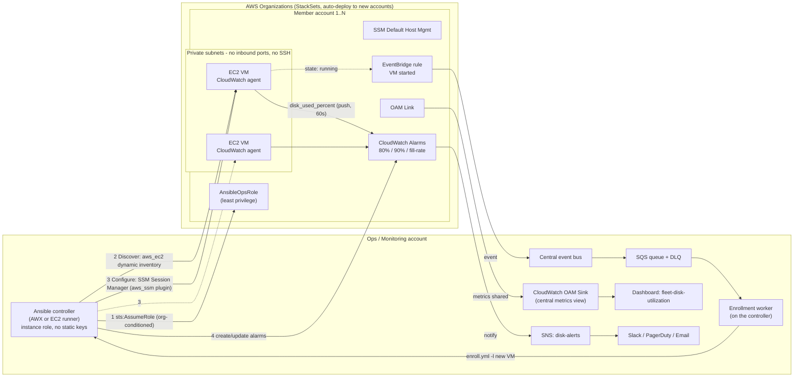

# Architecture

## Flow
0. **Trigger** - a VM entering `running` fires an EventBridge event -> central bus -> SQS -> worker -> `enroll.yml -l <that VM>`
   (an hourly safety-net run catches anything missed). Steps 1-4 below are what that run does.
1. **Access** - controller assumes `AnsibleOpsRole` in each account (trust locked to controller role + org ID).
2. **Discovery** - `aws_ec2` inventory per account/region; opt-out via tag `Monitoring=disabled`.
3. **Enrollment** - Ansible connects over SSM (no SSH), installs/configures the CloudWatch agent.
4. **Collection** - each VM *pushes* disk metrics to CloudWatch in its own account.
5. **Alerting** - Ansible creates per-disk alarms (80/90 % + predictive fill-rate) -> central SNS topic.
6. **Aggregation** - OAM links every account's metrics into one dashboard in the ops account.
7. **Assurance** - `verify_coverage.yml` lists VMs that are unreachable or not reporting.
